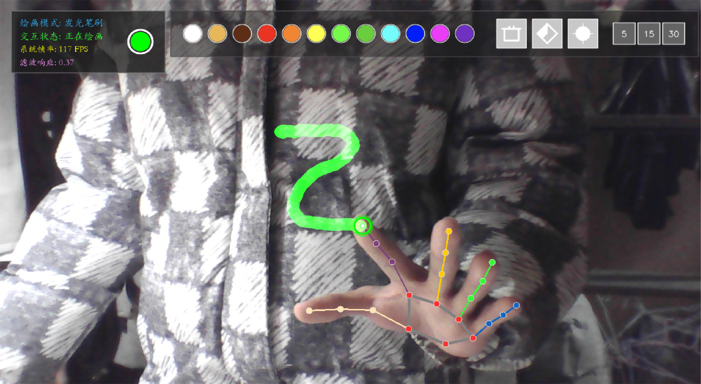
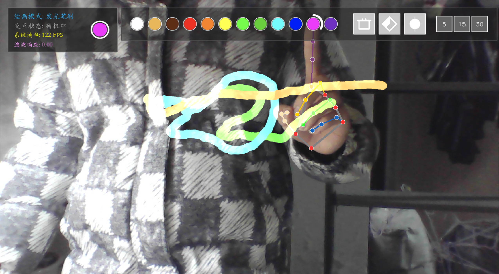
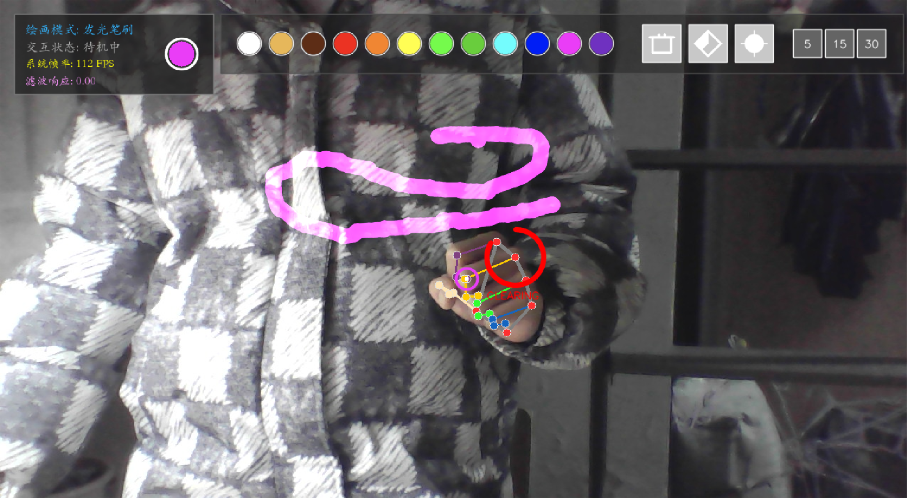

# 基于 MediaPipe 的非接触式手势绘画交互系统

一个基于摄像头的实时手势绘画项目。系统使用 **OpenCV** 完成视频流采集、画布渲染与界面显示，借助 **MediaPipe Hand Landmarker** 检测双手关键点，结合指尖轨迹时序滤波与停留点击机制，实现非接触式绘画、工具切换和手势清屏等交互功能。

本项目为个人学习与实践项目。

## 功能演示

### 1. 空中绘画

进入程序后，按空格键切换是否允许绘图。在绘画模式下，伸出食指并在绘图区内移动，即可完成空中绘画。



### 2. 工具栏交互

将食指停留在顶部工具栏按钮上并维持短暂时间后，可完成颜色切换、工具切换和笔刷尺寸调整。

- 颜色：支持 12 种颜色
- 工具：画笔、橡皮擦、清空画布
- 尺寸：支持 5、15、30 三种笔刷尺寸



### 3. 握拳清屏

保持握拳一段时间后，系统会触发清空画布操作。



### 4. 退出程序

按 `Esc` 键即可退出程序。

## demo展示

## 技术栈

- Python 3.11
- OpenCV
- MediaPipe Tasks Vision / Hand Landmarker
- NumPy
- Pillow

## 项目结构

```text
GestureDrawing/
├── hand_landmarker.task   # MediaPipe 手部关键点检测模型文件
├── landmarker.py          # 手部关键点检测封装与手势分析
├── main.py                # 主程序入口与交互主循环
├── rectangle.py           # 工具栏按钮组件与停留点击逻辑
├── stroke_filter.py       # 一欧元滤波与笔迹平滑逻辑
├── pyproject.toml         
├── uv.lock                
└── README.md              
```
## 项目细节

- 基于 `MediaPipe Hand Landmarker` 实现实时双手关键点检测与左右手识别
- 使用 `One Euro Filter` 对指尖轨迹进行时序平滑，降低抖动并改善书写体验
- 基于触发点停留时间的无接触式工具栏交互机制
- 支持颜色切换、笔刷尺寸调整、画笔/橡皮切换与握拳清屏
- 使用 `OpenCV + Pillow` 完成视频流、画布、按钮与 HUD 的统一渲染


## 运行环境

建议环境：

- Windows 10 / 11
- Python 3.11
- 可正常调用的摄像头设备

## 依赖资源

项目运行时需要以下资源文件与源码位于同一目录：

- `hand_landmarker.task`：MediaPipe 手部关键点检测模型文件

如果缺少该文件，程序将无法正常完成手部关键点检测。

## 安装与运行

### 使用 uv（推荐）

安装依赖：

```bash
uv sync
```

运行项目：

```bash
uv run python main.py
```

### 使用 pip

```bash
pip install mediapipe numpy opencv-python pillow
python main.py
```

## 许可证
> `MIT License` 